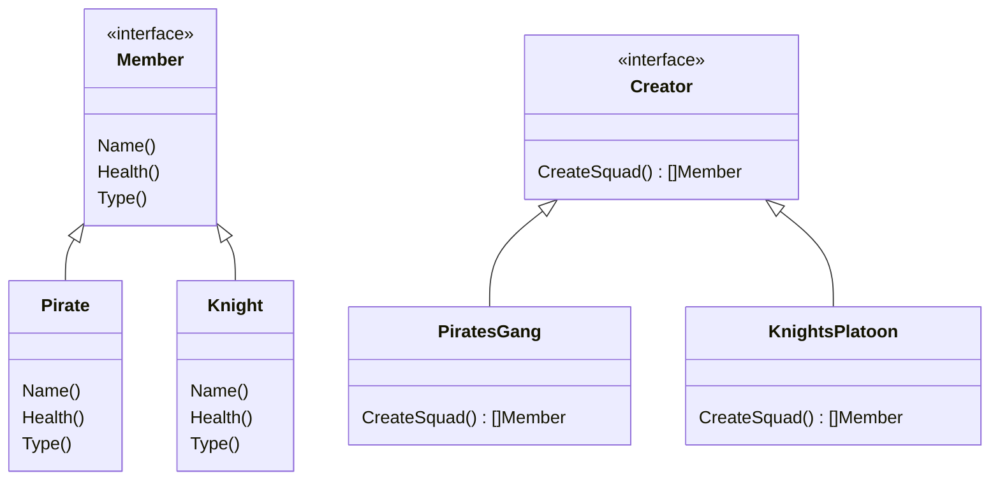

# Abstract method

```mermaid
classDiagram
    class Member
    <<interface>> Member
    Member : Name()
    Member : Health()
    Member : Type()

    Member <|-- Pirate
    Pirate : Name()
    Pirate : Health()
    Pirate : Type()

    Member <|-- Knight
    Knight : Name()
    Knight : Health()
    Knight : Type()

    class Creator
    <<interface>> Creator
    Creator : CreateSquad() []Member

    Creator <|-- PiratesGang
    PiratesGang : CreateSquad() []Member
    Creator <|-- KnightsPlatoon
    KnightsPlatoon : CreateSquad() []Member
```
