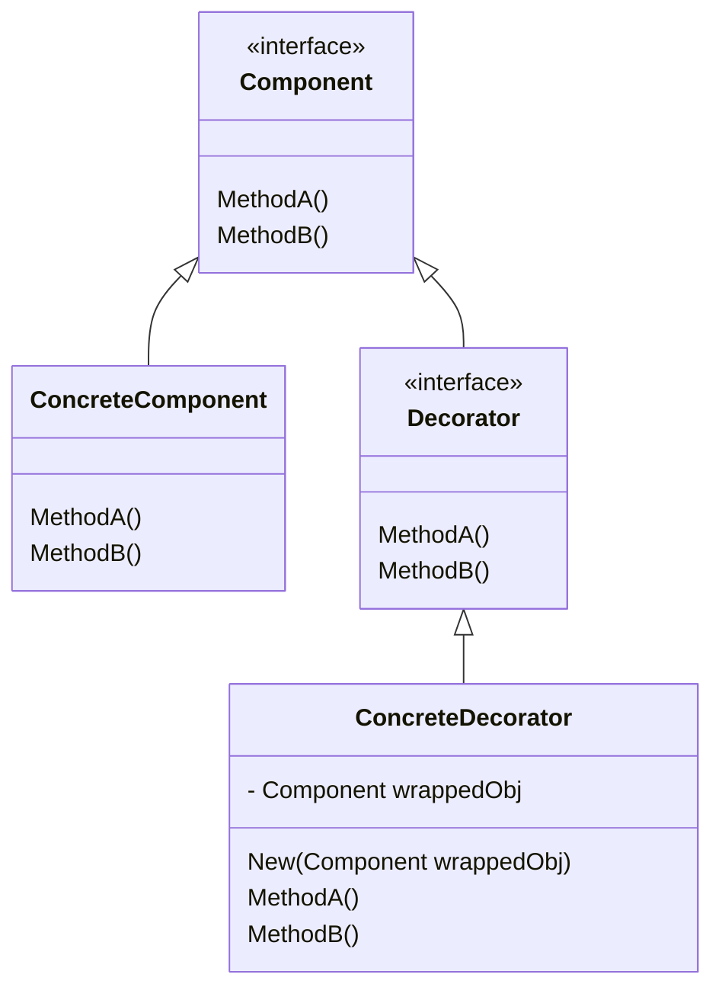

# Decorator

```mermaid
classDiagram
    class Component
    <<interface>> Component
    Component : MethodA()
    Component : MethodB()

    class ConcreteComponent
    Component <|-- ConcreteComponent
    ConcreteComponent : MethodA()
    ConcreteComponent : MethodB()

    class Decorator
    <<interface>> Decorator
    Component <|-- Decorator
    Decorator : MethodA()
    Decorator : MethodB()

    class ConcreteDecorator
    Decorator <|-- ConcreteDecorator
    ConcreteDecorator :-  Component wrappedObj
    ConcreteDecorator : New(Component wrappedObj)
    ConcreteDecorator : MethodA()
    ConcreteDecorator : MethodB()

```