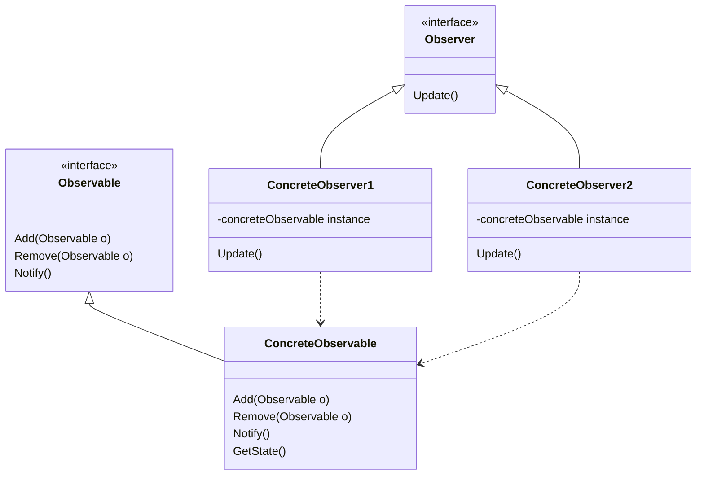
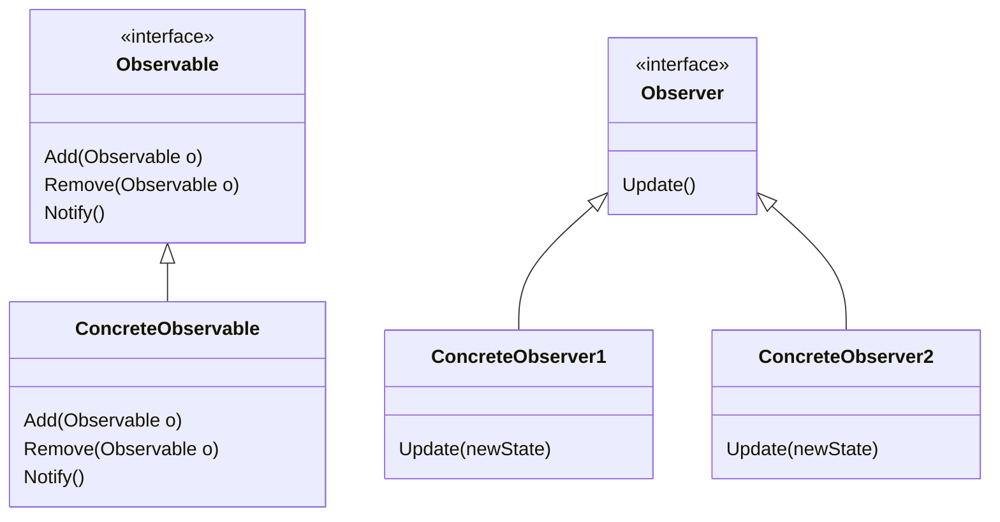

# Observer

## ConcreteObserver may have a ConcreteObservable instance and call ConcreteObservable.GetState() inside Update()

## ConcreteObserver receive updated state as an argument for Update(args)

